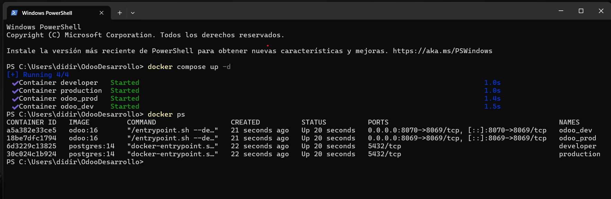

# PR0201

Para la creación de este entorno de contenedores primero se debe de crear un archivo `compose.yml` en el que vamos a indicar la construcción de estos y sus propiedades. Como el puerto, las conexiones entre los contenedores, los directorios que se crean...etc.

Primero crearemos el archivo `.yml`:

```yml
services:

  # *** Productos ***

  # postgres
  postgresProd:
    image: postgres:14
    container_name: production
    environment:
      - POSTGRES_DB=postgres
      - POSTGRES_USER=odoo
      - POSTGRES_PASSWORD=paso
    volumes:
      - ~/OdooDesarrollo/OdooDev/dataPG:/var/lib/postgresql/data

  # odoo
  odooProd:
    image: odoo:16
    container_name: odoo_prod
    environment:
      - HOST=postgresProd
      - USER=odoo
      - PASSWORD=paso
    ports:
      - '8069:8069'
    volumes:
      - ~/OdooDesarrollo/OdooDev/volumesOdoo/addons:/mnt/extra-addons
    depends_on:
      - postgresProd
    command: --dev=
  
  # *** Developers ***

  # postgres
  postgresDev:
    image: postgres:14
    container_name: developer
    environment:
      - POSTGRES_DB=postgres
      - POSTGRES_USER=odoo
      - POSTGRES_PASSWORD=paso
    volumes:
      - ~/OdooDesarrollo/OdooDev/dataPG-Dev:/var/lib/postgresql/data

  #odoo
  odooDev:
    image: odoo:16
    container_name: odoo_dev
    environment:
      - HOST=postgresDev
      - USER=odoo
      - PASSWORD=paso
    ports:
      - '8070:8069'
    volumes:
      - ~/OdooDesarrollo/OdooDev/volumesOdoo/addons:/mnt/extra-addons
      - ~/OdooDesarrollo/OdooDev/volumesOdoo/filestore:/var/lib/odoo/filestore
      - ~/OdooDesarrollo/OdooDev/volumesOdoo/sessions:/var/lib/odoo/sessions
    depends_on:
      - postgresDev
    command: --dev=
```

Despues de haber creado el archivo y confirmar que esta correctamente escrito, pasaremos al segundo paso para la creación de los contenedores.

Abrimeros una **terminal** en la ubicación del archivo `.yml`, en mi caso lo tengo situado dentro de *OdooDesarrollo*.
También abriremos **Docker** ya que si no lo tenemos abierto, los comandos que vamos a utilizar a continuación pueden dar errores.



Como se ve en la imagen, en nuestra terminal procederemos a usar el comando `docker compose up -d`.
Este comando va a crear el entorno de contenedores en base al código escrito en el archivo `.yml` inicial. El modificador `-d` pone el proceso en segundo plano, para que no veamos información innecesaria.

Como podemos ver en la imagen los contenedores se han creado correctamente ya que el comando nos ha devuelto que todos los contenedores estan `Started` (Que se han iniciado, y si se han iniciado es porque se han creado correctamente).

Despues utilizaremos el comando `docker ps` para mostrar los contenedores que estan iniciados.
Podemos ver en el resultado de este comando su ID, Imagen, cuando fueron creados, cuanto tiempo llevan iniciados, los puertos que tienen y a donde apuntan y sus nombres.

Con todo esto, confirmamos que se han creado creado y estructurado correctamente.