# PR0302

* Primero tendremos que descargar el modulo de *Inventario*, para ello nos aseguraremos de estar en el apartado de "Aplicaciones". Buscaremos el modulo correspondiente y haremos clic en "ACTIVAR".

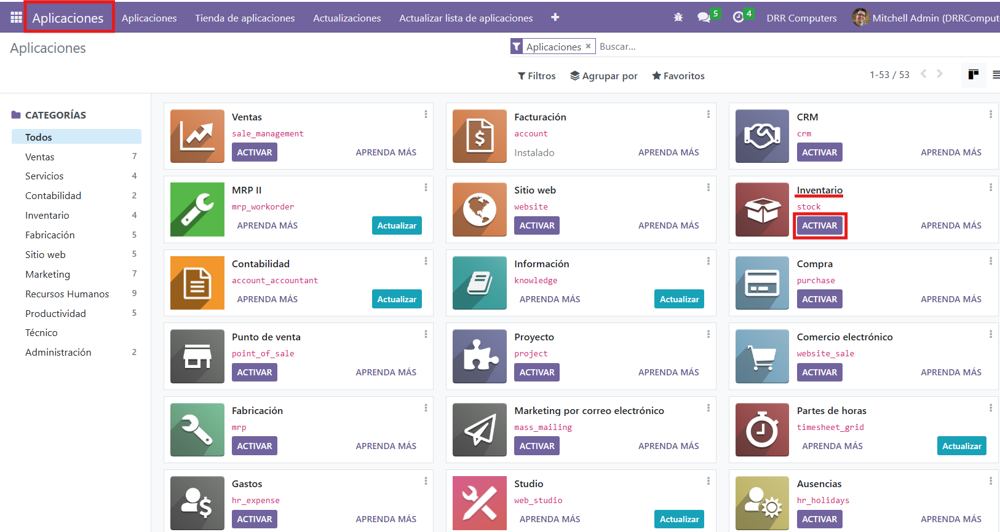

* Ahora debemos importar el fichero excel de los productos, para ello debemos de entrar en el apartado de "Inventario", haremos clic en el menu en la parte superior izquierda y seleccionaremos "Inventario".

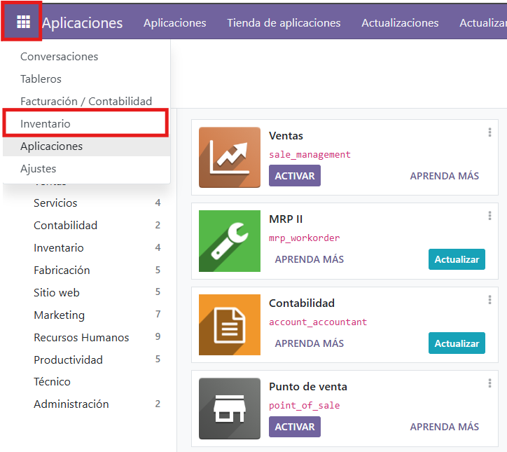

* Una vez estemos en Inventario, entreremos en el apartado de "Productos".

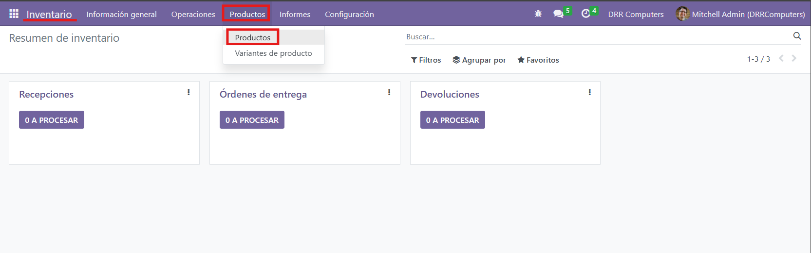

* Una vez hecho esto, para importar el excel con los productos tendremos que hacer clic en "Favoritos" y seleccionar las opción de "Importar registros".

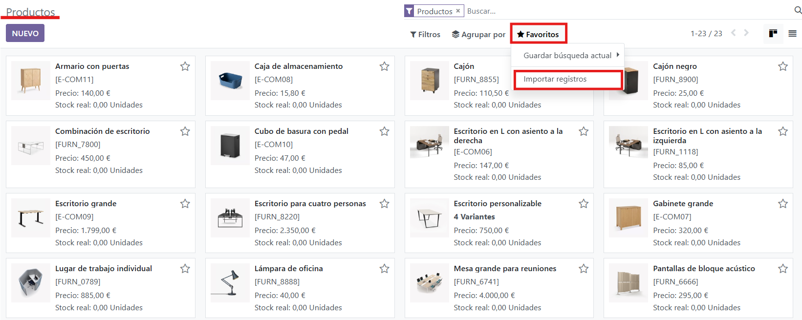

* Haremos clic en "Subir un archivo":

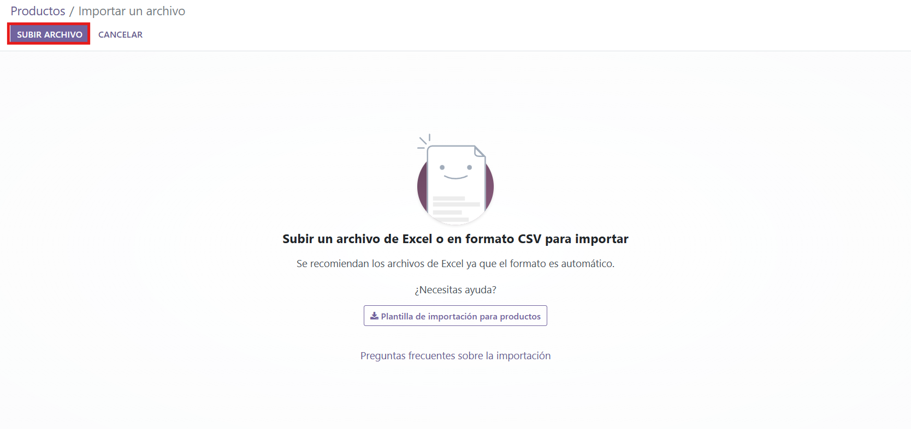

* Ahora rellenamos los campos necesarios y una vez los tengamos, haremos clic en "Importar" en la parte superior izquierda.

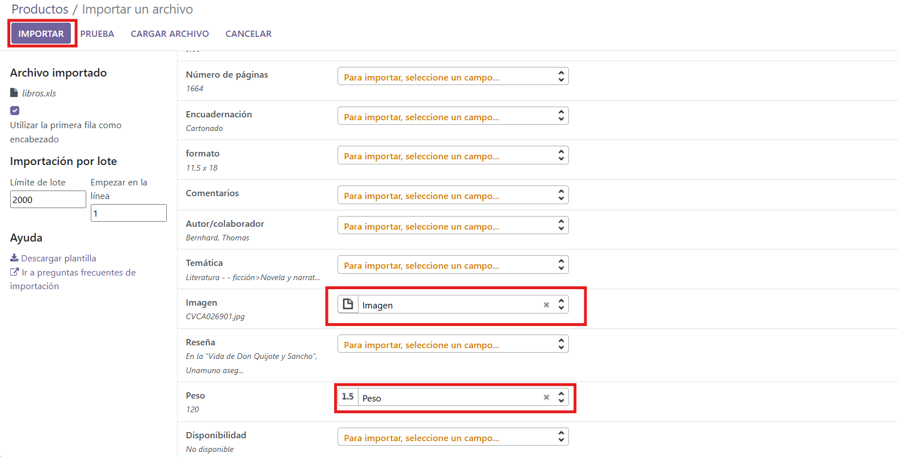

* Si nos fijamos en el apartado de productos nuevamente, podremos ver los nuevos productos que hemos importado.

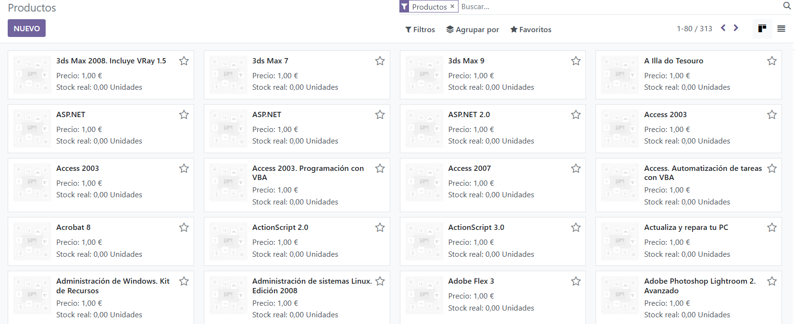

* Ahora para la creación de la API para imagenes de google, tendremos que seguir estos pasos:

1. Tendremos que acceder a: https://console.cloud.google.com/apis/dashboard para comenzar con su creación. Tendremos que registrarnos con nuestra cuenta de Google.
2. Una vez estemos dentro, tendremos que crear un nuevo proyecto. Cuando lo tengamos creado accederemos al apartado de "Credenciales".

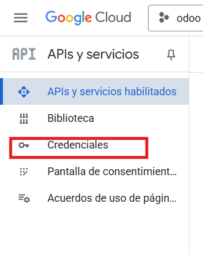

3. Hacemos clic en "Crear creedenciales y procederemos a seguir los pasos indicados por la pagina y crear nuestra clave de api.

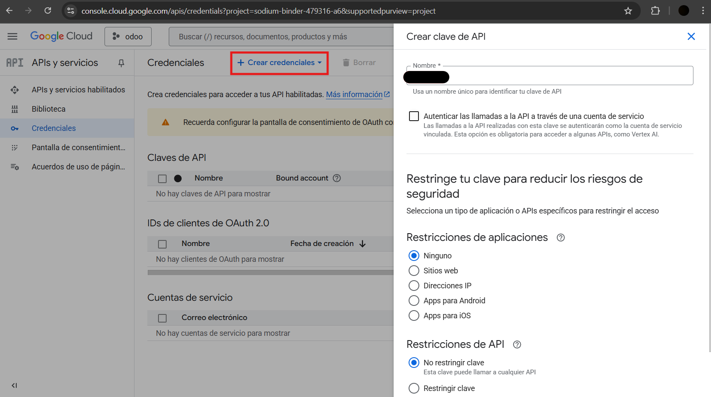

4. Cuando termiens la creacion se nos propocionara el codigo de la clave.

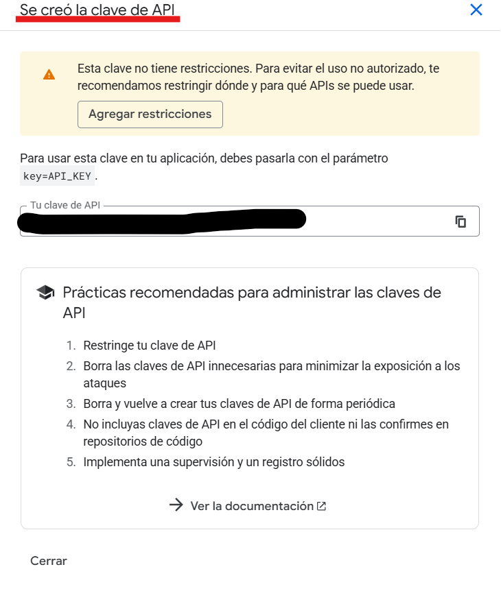

5. En el buscador de la propia pagina pondremos "Custom Search API" y la habilitaremos.

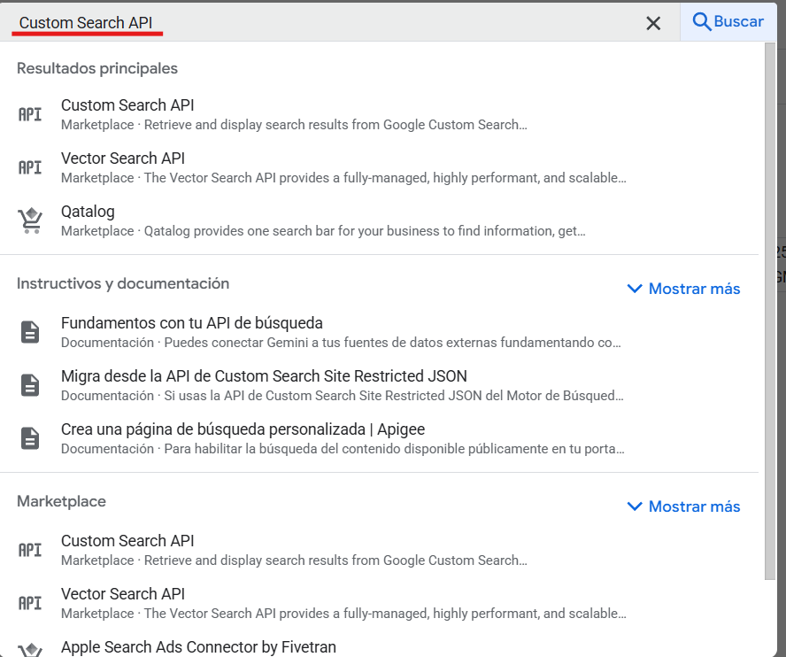

6. Ahora debemos de acceder a otra pagina distinta, la cual será:
https://programmablesearchengine.google.com/about/ una vez estemos dentro de la pagina tendremos que hacer clic en "empezar" o "get started".

Despues haremos clic en "Añadir" para crear un buscador, y tendremos que rellenar los campos de esta forma:

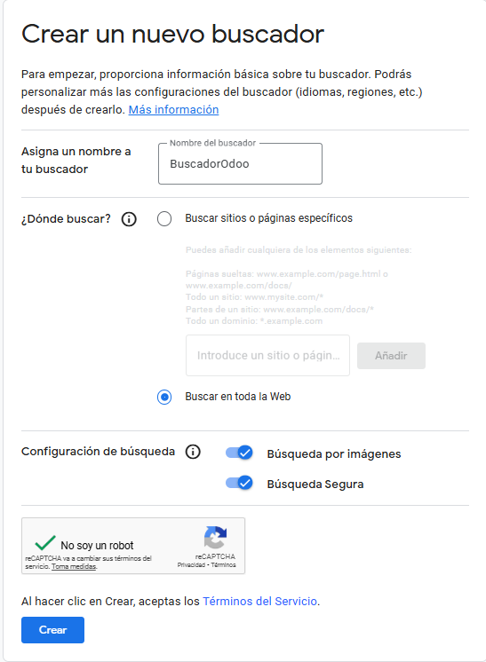

7. Una vez el buscador este creado, tendremos que hacer clic en "Personalizar":

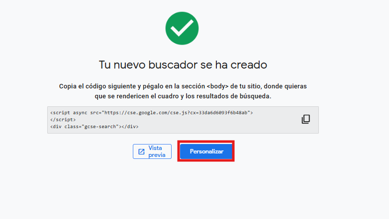

8. Se nos mostraran una serie de datos sobre el buscador, tendremos que quedarnos con la id del buscador, ya que sera necesaría más adelanta, copiandola y gurdandola, podemos darle al boton marcado para copiarla directamente al portapepeles.

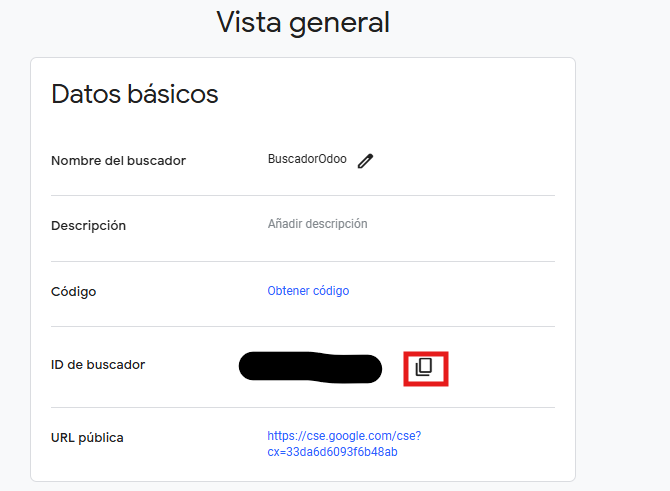

9. Despues de todo esto debemos de entrar a Odoo, y activar algunas configuraciones en los ajustes.

Debemos de entrar a "Opciones generales" en el apartado de ajustes.
En subapartado de "Integraciones" podemos encontrar el ajuste de "Google Imagenes", debemos de marcar su casilla correspondiente para activarlo. Despues haremos clic en "Guardar".

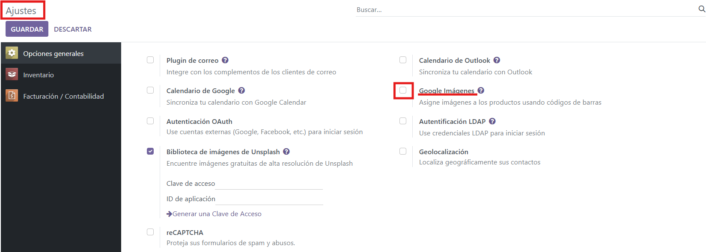

10. Despues de haber guardado se no mostrara unos campos para rellenar con la api y el buscador. Los rellenaremos. Una vez introducidos haremos clic en "Guardar".

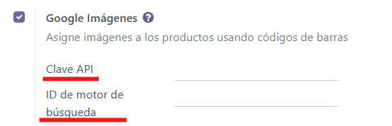

11. Selecionamos los productos que queramos, hacemos clic en "Accion" y seleccionamos "Obtener imagenes de Google Imagenes":

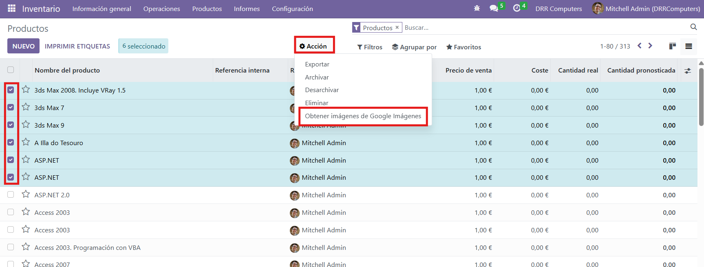

12. Como podemos ver se muestran las imagenes:

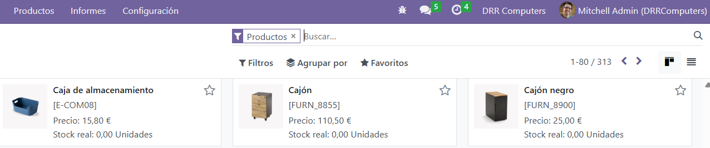
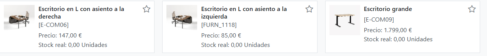