# PR0302

Primero para crear nuestro entorno crearemos un archivo `compose.yaml` con la configuración que deben de tener los contenedores.

```yaml
services:

  # postgres
  postgres:
    image: postgres:14
    container_name: postgres
    environment:
      - POSTGRES_DB=postgres
      - POSTGRES_USER=odoo
      - POSTGRES_PASSWORD=paso
    volumes:
      - ~/OdooDesarrollo/OdooDev/dataPG:/var/lib/postgresql/data

  # odoo
  odoo:
    image: odoo:16
    container_name: odoo
    environment:
      - HOST=postgres
      - USER=odoo
      - PASSWORD=paso
    ports:
      - '8069:8069'
    volumes:
      - ~/OdooDesarrollo/OdooDev/volumesOdoo/addons:/mnt/extra-addons
    depends_on:
      - postgres
    command: --dev=
```

Despues nos situaremos en la ruta donde esta este archivo, abriremos una terminal y ejecutaremos `docker compose up -d` para crear los contenedores, despues nos aseguramos que los contenedores se hayan iniciado en Docker y accederemos desde nuestro buscador a localhost:`el puerto que escogimos` que en mi caso es el 8069.
Una vez accedamos nos va a pedir que creemos nuestro entorno de Odoo introduciendo algunos datos.

Despues de la creación tenemos que...

* Asegurarnos que hemos puesto el nombre correcto a nuestra empresa:

Para ello podemos comprobarlo y editarlo en:


* Ahora para crear un nuevo usuario debemos de entrar en Ajustes:


* En el apartado de Usuarios entraremos en `Gestion de Usuarios`:

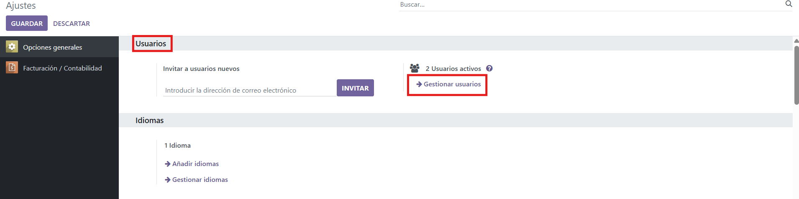

* Ahora en la parte superior izquierda haremos clic en `Nuevo`:

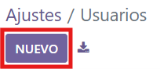

* Para crear un nuevo usuario rellenaremos los campos, y para darle permisos solo en el area de Facturación nos aseguraremos de en `Accounting` pondremos Facturación.

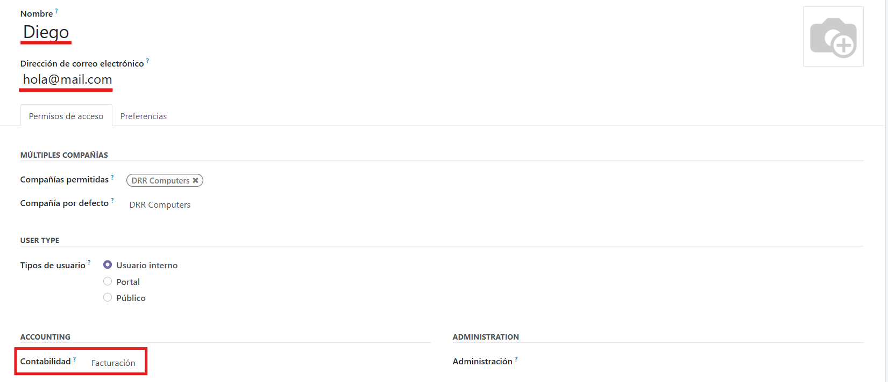

* Ahora para modificar las facturas abriremos el menu de ajustes y entraremos en `Ajustes`.


* Una vez estemos en el apartado de ajustes, entraremos en `Facturación/Contabilidad`

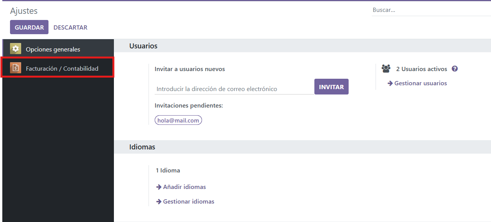

* Antes de empezar a modificar las facturas, nos desplazaremos hasta encontrar el apartado de `Pagos de cliente`, debemos activar los Codigo QR para ellas:

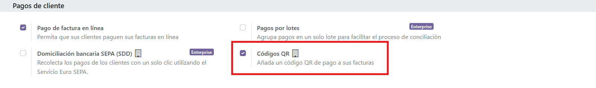

* Ahora para configurar el documento de las facturas, en el apartado de ajustes, entremos en `Opciones generales`.

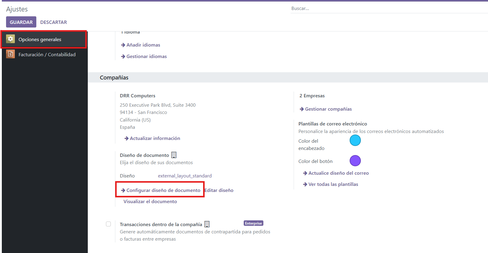

* Cambiaremos el color de los botones y pondremos un logotipo a la empresa.

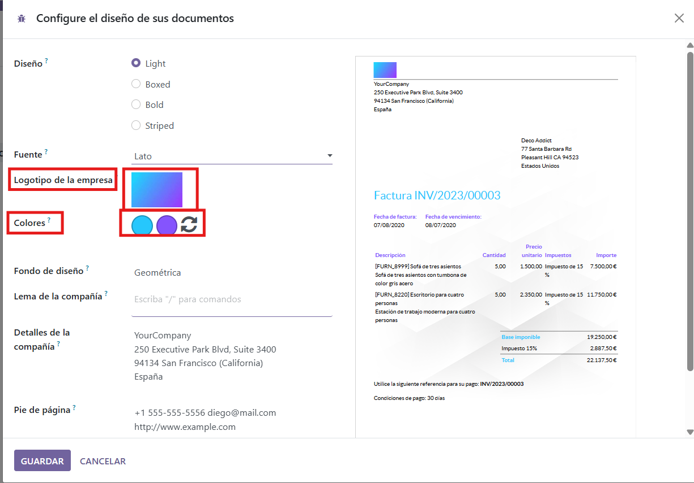

* Para cargar los datos de clientes de un archiv `.csv` tendremos que, volver a abrir ajustes y entrar en el apartado de `Facturación/Contabilidad`.


* Nos aseguraremos de estar en el apartado de `Clientes`. Haremos clic en `Favoritos` y seleccionaremos la opción de `Importar registros`.

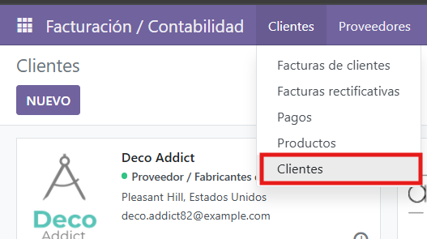

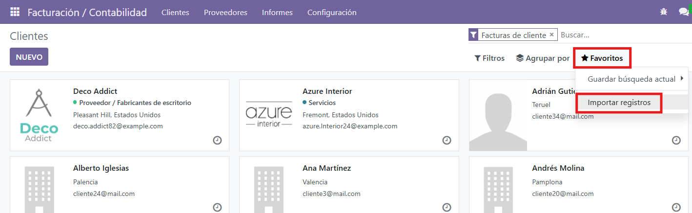

* Haremos clic en subir archivo:


* Pondremos los campos necesarios y despues haremos clic en `Importar`.

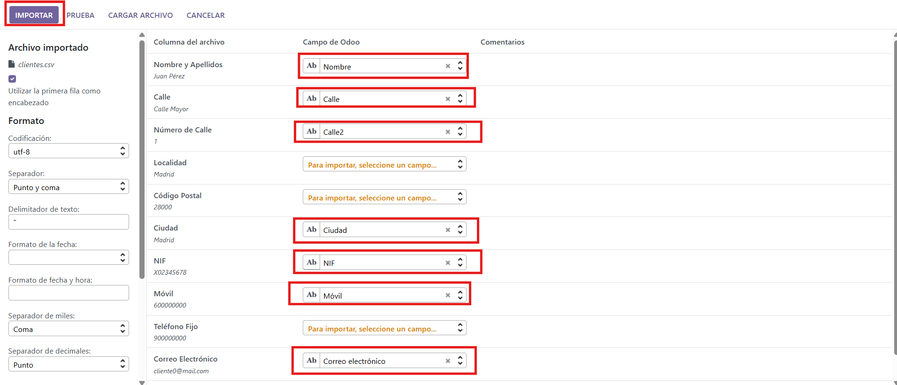

* Como podemos ver los clientes del archivo se han cargado correctamente:

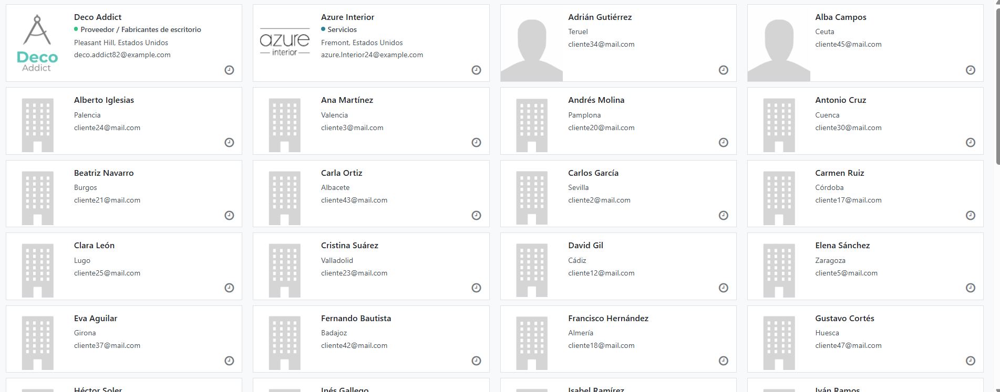

* Para entrar desde otro usuario, primero tendremos que cerrar sesión, haremos clic en el usuario que estamos utilizando actualmente (el admin) y seleccionaremos `Cerrar sesión`.


* Ahora introduciremos los datos que introducimos al crear el anterior usuario:


* Como podemos ver si hemos introducido las creedenciales del usuario correctamente, estaremos dentro, en la cuenta del usuario creado anteriormente:


* Entraremos en el apartado de Facturas para crear una nueva:


* Ahora haremos clic en `NUEVO`:


* Rellenamos la información de la nueva factura con los datos deseados y hacemos clic en `Añadir una linea` para escoger los productos, en mi caso he escogido una mesa grande para reuniones como producto:

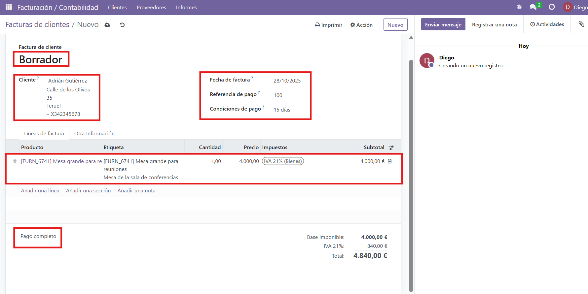

* Una vez introducidos todos los campos necesarios haremos clic en `Confirmar` en la parte superior derecha:


* Como podemos ver la factura se ha generado correctamente:

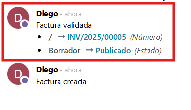

### Pdf Factura creada:

[Factura](./FacturaCreada.pdf)