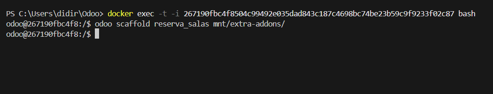
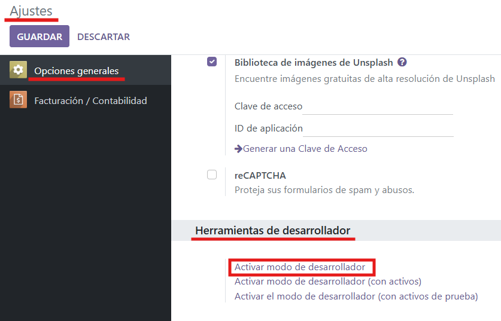
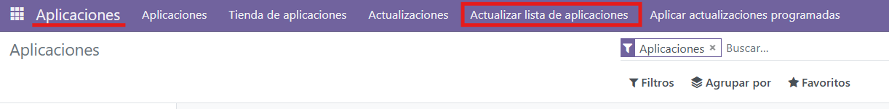
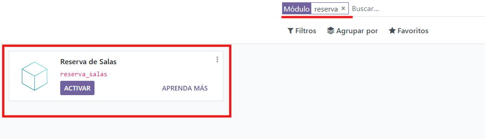
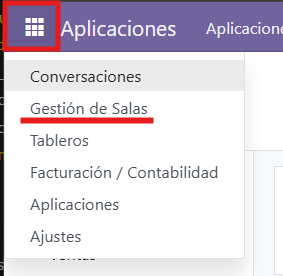
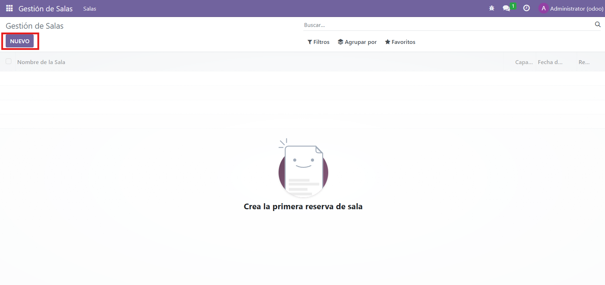
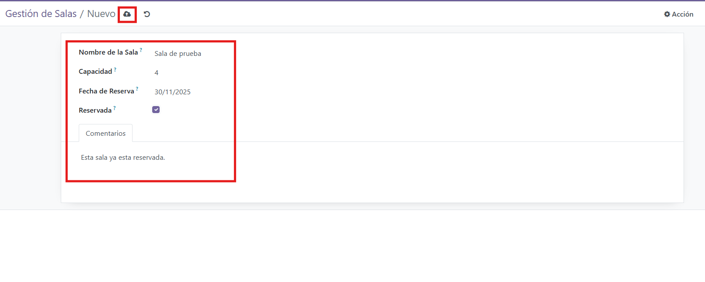
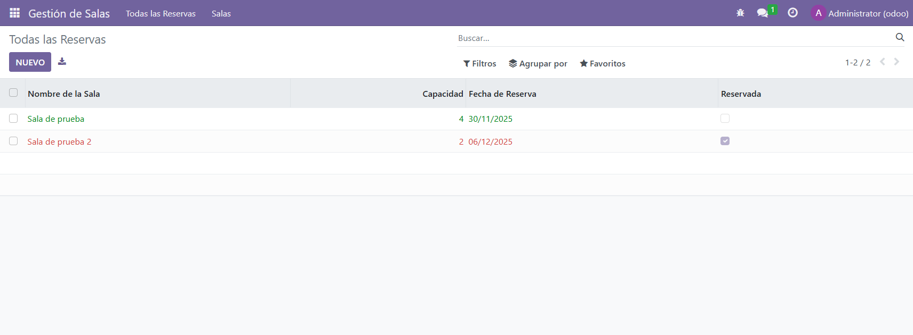
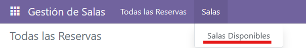
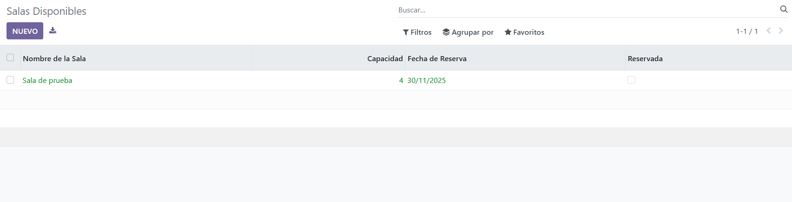

# PR0501

Para la realizar la creación de un modulo de odoo que pueda gestionar reservas de salas. Tendremos que realizar los siguientes pasos:


Primero debemos acceder a nuestro contenedor de Odoo desde Visual Studio Code o cualquier otro IDE.
Despues tendremos que preparar la estructura de directorios para el modulo, podríamos hacerlo a mano, pero utilizar odoo scaffold es mucho más rapido.
Por lo que accederemos a la terminal e introduciremos los siguientes comandos:



El primer comando nos abrirá una terminal (bash) en el propio contenedor que le hayamos indicado mediante el propio id de este.
El segundo comando usa `odoo scaffold` para crear un modulo que se llame "reserva_salas" y le indicamos la ruta donde deben de estar situados los modulos "mtn/extra-addons/".

Despues de ejecutar estos comandos, se creará la estructura completa y solo tendremos que modificarla. Con esto ya tenemos la base del modulo hecha.

* El primer archivo que vamos a cambiar sera `__manifest.py__`:

```python
# -*- coding: utf-8 -*-
{
    'name': "Reserva de Salas",

    'summary': """
        Un modulo para gestionar reservas de salas    
    """,

    'description': """
        
    """,

    'author': "Diego",
    'website': "https://www.yourcompany.com",

    # Categories can be used to filter modules in modules listing
    # Check https://github.com/odoo/odoo/blob/16.0/odoo/addons/base/data/ir_module_category_data.xml
    # for the full list
    'category': 'Productividad',
    'version': '0.1',

    # any module necessary for this one to work correctly
    'depends': ['base'],

    # always loaded
    'data': [
        'security/ir.model.access.csv',
        'views/views.xml',
        'views/templates.xml',
    ],
    # only loaded in demonstration mode
    'demo': [
        'demo/demo.xml',
    ],
}
```

Este archivo contiene información general que va a tener nuestro modulo.
Cambiaremos algunas cosas esenciales como el nombre, descripción...etc.

* Despues modificaremos `models.py`:

```python
# -*- coding: utf-8 -*-

from odoo import models, fields, api


class ReservaSala(models.Model):
    _name = 'reserva.sala'
    _description = 'Gestión de Reservas de Salas'

    # 1. Nombre de la Sala (tipo texto)
    name = fields.Char(
        string='Nombre de la Sala', 
        required=True
    )
    
    # 2. Capacidad (tipo entero)
    capacidad = fields.Integer(
        string='Capacidad', 
        required=True
    )
    
    # 3. Fecha de Reserva (tipo fecha)
    fecha_reserva = fields.Date(
        string='Fecha de Reserva', 
        required=True
    )
    
    # 4. Reservada (tipo booleano)
    reservada = fields.Boolean(
        string='Reservada', 
        default=False,
        help='Indica si la sala está ocupada para la fecha seleccionada.'
    )
    
    # 5. Comentarios (tipo texto)
    comentarios = fields.Text(
        string='Comentarios'
    )

```

En este archivo crearemos los campos que necesitaremos para la gestion de las salas, cada campo con su tipo y sus caracteristicas.

* Ahora modificaremos el archivo `views.xml`, para darle una interfaz usable para el usuario a nuestro modulo:

```xml
<odoo>
  <data>

    <record model="ir.ui.view" id="reserva_salas_list">
      <field name="name">reserva.sala.list</field>
      <field name="model">reserva.sala</field>
      <field name="arch" type="xml">
        <tree decoration-success="reservada == False" decoration-danger="reservada == True">
          <field name="name"/>
          <field name="capacidad"/>
          <field name="fecha_reserva"/>
          <field name="reservada"/>
        </tree>
      </field>
    </record>

    <record model="ir.ui.view" id="reserva_salas_form">
      <field name="name">reserva.sala.form</field>
      <field name="model">reserva.sala</field>
      <field name="arch" type="xml">
        <form>
          <sheet>
            <group>
              <field name="name"/>
              <field name="capacidad"/>
              <field name="fecha_reserva"/>
              <field name="reservada" widget="toggle_button"/>
            </group>
            <notebook>
              <page name="comentarios_page" string="Comentarios">
                <field name="comentarios"/>
              </page>
            </notebook>
          </sheet>
        </form>
      </field>
    </record>

    <record model="ir.actions.act_window" id="reserva_salas_action_window">
      <field name="name">Salas Disponibles</field>
      <field name="res_model">reserva.sala</field>
      <field name="view_mode">tree,form</field>
      <field name="domain">[('reservada', '=', False)]</field>
      <field name="context">{'default_reservada': False}</field>
      <field name="help" type="html">
          <p class="o_view_nocontent_smiling_face">
              Crea la primera sala disponible
          </p>
      </field>
    </record>

    <record model="ir.actions.act_window" id="reserva_salas_action_all">
        <field name="name">Todas las Reservas</field>
        <field name="res_model">reserva.sala</field>
        <field name="view_mode">tree,form</field>
        <field name="help" type="html">
            <p class="o_view_nocontent_smiling_face">
                Crea una nueva reserva.
            </p>
        </field>
    </record>
    
    <menuitem 
        name="Gestión de Salas" 
        id="menu_gestion_salas_root" 
        sequence="10"
        groups="base.group_user"/>

    <menuitem 
        name="Todas las Reservas" 
        id="menu_todas_las_reservas_action" 
        parent="menu_gestion_salas_root" 
        action="reserva_salas_action_all" 
        sequence="5"/>

    <menuitem 
        name="Salas" 
        id="menu_salas_categoria" 
        parent="menu_gestion_salas_root" 
        sequence="10"/>

    <menuitem 
        name="Salas Disponibles" 
        id="menu_salas_disponibles_action" 
        parent="menu_salas_categoria" 
        action="reserva_salas_action_window" 
        sequence="10"/>

    <menuitem 
        name="Reservas" 
        id="menu_reservas_categoria" 
        parent="menu_gestion_salas_root" 
        sequence="20"/>

    <menuitem 
        name="Reservas realizadas" 
        id="menu_reservas_realizadas_placeholder" 
        parent="menu_reservas_categoria" 
        sequence="10"/>

  </data>
</odoo>
```

En este archivo crearemos los menus del modulo. Haciendo que se muestren los datos correspondientes con las salas.

* Ahora podremos comprobar que el modulo funciona correctamente descargandolo en Odoo:

Lo primero hay que tener en cuenta que tendremos que activar el modo desarrollador para poder actualizar la lista de apps presentes en Odoo. Pero debemos de tener minimmo una app instalada para poder acceder a la parte de ajustes de herramientas de desarrollador, asi que instalaremos una.

Ahora tendremos que acceder a Ajustes > Opciones generales > Herramientas de desarrollador.



Actualizaremos la lista de apps para que podamos ver la nuestra que hemos estado creando:



Despues de esto solo tendremos que utilizar el buscador para encontrarla:



Para descargarlo haremos clic en "ACTIVAR".

Ahora podremos ver que tenemos una nueva opción en el menu, que es la opción de nuestro modulo:



* Ahora vamos a probar nuestro modulo, creando una reserva de prueba:

Hacemos clic en "NUEVO":



Rellenaremos los campos y cuando queramos guardar la reserva haremos clic en la nube situada arriba a la derecha, para guardar la reserva manualmente:



Crearé algunas reservas de prueba:



Y ahora si accedemos al menu de las Salas disponibles se nos mostraran solo las que no estan reservadas:





