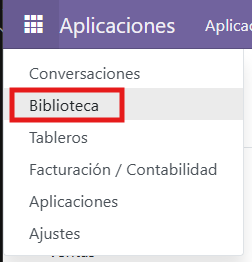
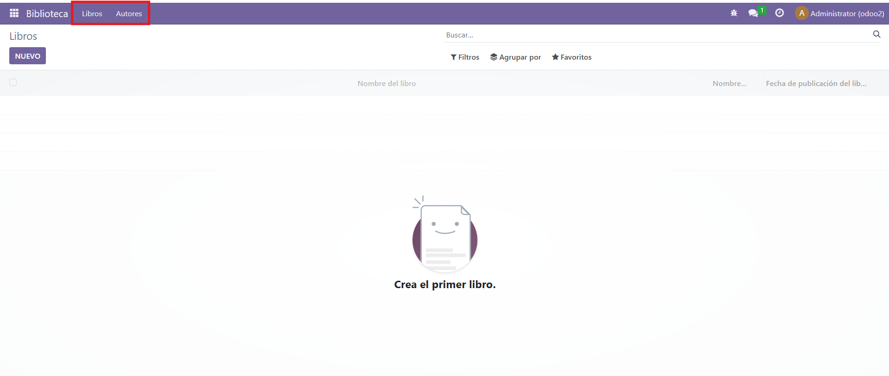
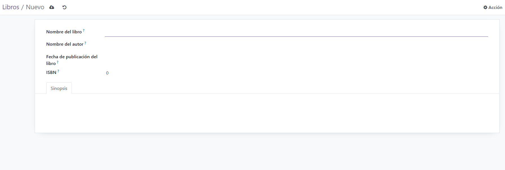
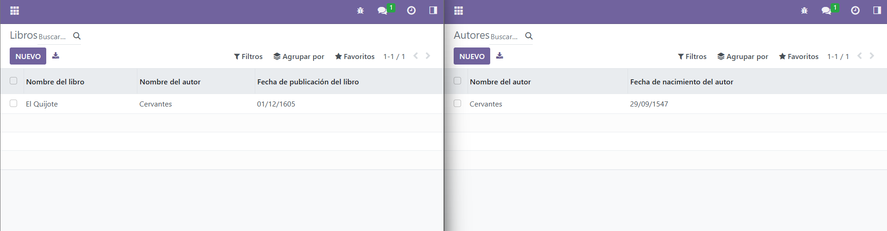

# PR0502

Para hacer este modulo de una libraría seguiremos un proceso similar al de la practica anterior.

Modificaremos y crearemos algunos archivos:

* models/init.py

```python
# -*- coding: utf-8 -*-

from . import library_books
from . import library_authors
```

* models/library_authors.py

```python
# -*- coding: utf-8 -*-

from odoo import models, fields, api

class library_authors(models.Model):
    _name = 'library.author'
    _description = 'library.library'

    name = fields.Char(
       string='Nombre del autor',
       required=True
    )

    fecha_nacimiento = fields.Date(
       string='Fecha de nacimiento del autor',
       required=True
    )

    biografia = fields.Text(
        string='Biografía del autor',
        required=True
    )

    libros = fields.Text(
        string='Libros del autor',
        required=True
    )
```

* models/libros_books.py

```python
# -*- coding: utf-8 -*-

from odoo import models, fields, api

class library_books(models.Model):
    _name = 'library.book'
    _description = 'library.library'

    name = fields.Char(
        string='Nombre del libro',
        required=True
    )
    
    autor = fields.Char(
        string='Nombre del autor',
        required=True
    )

    fecha_publicacion = fields.Date(
        string='Fecha de publicación del libro',
        required=True
    )

    isbn = fields.Integer(
        string='ISBN',
        required=True
    )

    sinopsis = fields.Text(
        string='Sinopsis',
        required=True
    )

```

* security/ir.model.access.csv

```csv
id,name,model_id:id,group_id:id,perm_read,perm_write,perm_create,perm_unlink
access_library_book,Library Book Access,model_library_book,base.group_user,1,1,1,1
access_library_author,Library Author Access,model_library_author,base.group_user,1,1,1,1
```

* views/library_authors_view.xml

```xml
<odoo>
    <data>
        <record model="ir.ui.view" id="library_author_list_view">
            <field name="name">library.author.list</field>
            <field name="model">library.author</field>
            <field name="arch" type="xml">
                <tree>
                    <field name="name"/>
                    <field name="fecha_nacimiento"/>
                </tree>
            </field>
        </record>

        <record model="ir.ui.view" id="library_author_form_view">
            <field name="name">library.author.form</field>
            <field name="model">library.author</field>
            <field name="arch" type="xml">
                <form>
                    <sheet>
                        <group>
                            <field name="name"/>
                            <field name="fecha_nacimiento"/>
                        </group>
                        <notebook>
                            <page name="biography" string="Biografía y Libros">
                                <field name="biografia"/>
                                <field name="libros"/>
                            </page>
                        </notebook>
                    </sheet>
                </form>
            </field>
        </record>

        <record model="ir.actions.act_window" id="library_author_action">
            <field name="name">Autores</field>
            <field name="res_model">library.author</field>
            <field name="view_mode">tree,form</field>
            <field name="help" type="html">
                <p class="o_view_nocontent_smiling_face">
                    Crea el primer autor.
                </p>
            </field>
        </record>
    </data>
</odoo>
```

* views/library_books_view.xml

```xml
<odoo>
    <data>
        <record model="ir.ui.view" id="library_book_list_view">
            <field name="name">library.book.list</field>
            <field name="model">library.book</field>
            <field name="arch" type="xml">
                <tree>
                    <field name="name"/>
                    <field name="autor"/>
                    <field name="fecha_publicacion"/>
                </tree>
            </field>
        </record>

        <record model="ir.ui.view" id="library_book_form_view">
            <field name="name">library.book.form</field>
            <field name="model">library.book</field>
            <field name="arch" type="xml">
                <form>
                    <sheet>
                        <group>
                            <field name="name"/>
                            <field name="autor"/>
                            <field name="fecha_publicacion"/>
                            <field name="isbn"/>
                        </group>
                        <notebook>
                            <page name="sinopsis" string="Sinopsis">
                                <field name="sinopsis"/>
                            </page>
                        </notebook>
                    </sheet>
                </form>
            </field>
        </record>

        <record model="ir.actions.act_window" id="library_book_action">
            <field name="name">Libros</field>
            <field name="res_model">library.book</field>
            <field name="view_mode">tree,form</field>
            <field name="help" type="html">
                <p class="o_view_nocontent_smiling_face">
                    Crea el primer libro.
                </p>
            </field>
        </record>
    </data>
</odoo>
```

* views/library_menu_view.xml

```xml
<odoo>
    <data>
        <menuitem 
            name="Biblioteca" 
            id="menu_library_root" 
            sequence="10"
            groups="base.group_user"/>

        <menuitem 
            name="Libros" 
            id="menu_library_books" 
            parent="menu_library_root" 
            action="library_book_action" 
            sequence="10"/>

        <menuitem 
            name="Autores" 
            id="menu_library_authors" 
            parent="menu_library_root" 
            action="library_author_action" 
            sequence="20"/>
            
        <menuitem 
            name="Configuración" 
            id="menu_library_configuration" 
            parent="menu_library_root" 
            sequence="30"/>
    </data>
</odoo>
```

* manifest.py

```python
# -*- coding: utf-8 -*-
{
    'name': "Libreria",

    'summary': """
        Biblioteca
        """,

    'description': """
        
    """,

    'author': "My Company",
    'website': "https://www.yourcompany.com",

    # Categories can be used to filter modules in modules listing
    # Check https://github.com/odoo/odoo/blob/16.0/odoo/addons/base/data/ir_module_category_data.xml
    # for the full list
    'category': 'Productivity',
    'version': '0.1',

    # any module necessary for this one to work correctly
    'depends': ['base'],

    # always loaded
    'data': [
        'security/ir.model.access.csv',
        'views/library_books_view.xml',
        'views/library_authors_view.xml',
        'views/library_menu_view.xml',
        'views/templates.xml',
    ],
    # only loaded in demonstration mode
    'demo': [
        'demo/demo.xml',
    ],
}

```

### Funcionalidad de modulo de Odoo:

Se muestra en el menu:





Crear un libro o un autor:




Ejemplos:



Si hacemos clic en cualquiera de los dos, saldran sus datos:

