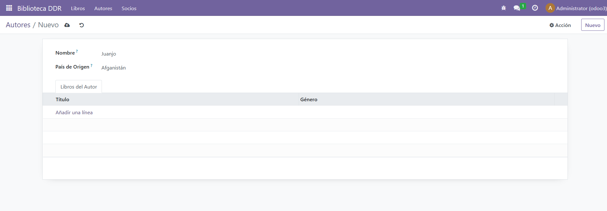
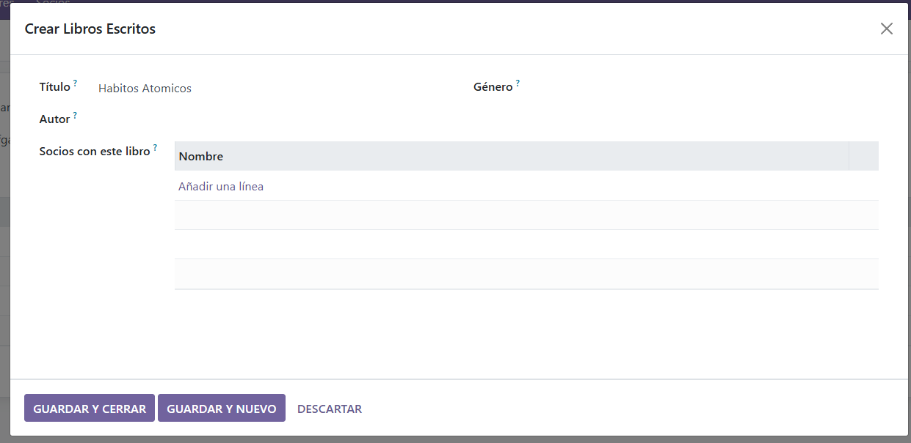
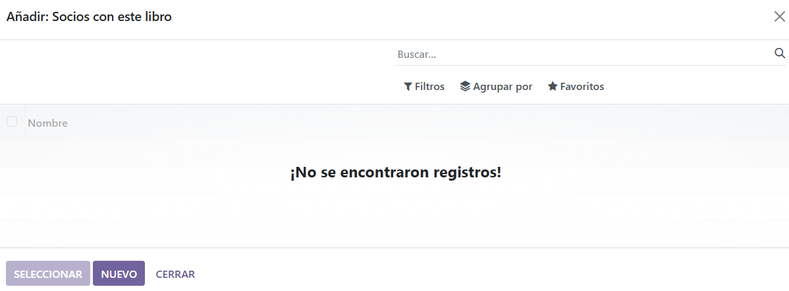
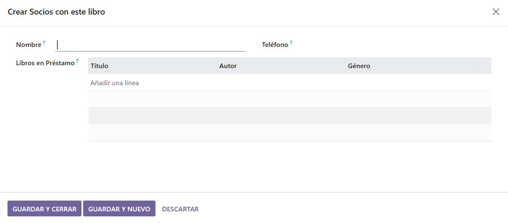

# PR0602

* library_member.py:

```python
from odoo import models, fields

class LibraryMember(models.Model):
    _name = 'library_ddr.member'
    _description = 'Socio de la Biblioteca'

    name = fields.Char(string='Nombre', required=True)
    phone = fields.Char(string='Teléfono')
    # Relación Many2many: Un socio puede tener varios libros prestados
    book_ids = fields.Many2many('library_ddr.book', string='Libros en Préstamo')
```

* library_book.py:

```python
from odoo import models, fields

class LibraryBook(models.Model):
    _name = 'library_ddr.book'
    _description = 'Libro'

    name = fields.Char(string='Título', required=True)
    genre = fields.Selection([
        ('novela', 'Novela'),
        ('drama', 'Drama'),
        ('ciencia_ficcion', 'Ciencia Ficción'),
        ('misterio', 'Misterio'),
        ('terror', 'Terror'),
        ('historico', 'Histórico')
    ], string='Género')
    
    # Relación Many2one: Muchos libros pertenecen a un autor
    author_id = fields.Many2one('library_ddr.author', string='Autor')
    # Relación Many2many: Un libro puede ser prestado a varios socios
    member_ids = fields.Many2many('library_ddr.member', string='Socios con este libro')
```

* library_author.py:

```python
from odoo import models, fields

class LibraryAuthor(models.Model):
    _name = 'library_ddr.author'  # Nombre técnico único
    _description = 'Autor'

    name = fields.Char(string='Nombre', required=True)
    # Relación Many2one con el modelo de países de Odoo
    country_id = fields.Many2one('res.country', string='País de Origen')
    # Relación One2many (Inversa de los libros)
    book_ids = fields.One2many('library_ddr.book', 'author_id', string='Libros Escritos')
```

* init.py:

```python
# -*- coding: utf-8 -*-

from . import library_author
from . import library_book
from . import library_member
```

* ir.model.access.csv:

```csv
id,name,model_id:id,group_id:id,perm_read,perm_write,perm_create,perm_unlink
access_library_book,library.book.access,model_library_ddr_book,base.group_user,1,1,1,1
access_library_author,library.author.access,model_library_ddr_author,base.group_user,1,1,1,1
access_library_member,library.member.access,model_library_ddr_member,base.group_user,1,1,1,1
```

* library_menus.xml:
  
```xml
<odoo>
    <record id="action_books" model="ir.actions.act_window">
        <field name="name">Libros</field>
        <field name="res_model">library_ddr.book</field>
        <field name="view_mode">tree,form</field>
    </record>

    <record id="action_authors" model="ir.actions.act_window">
        <field name="name">Autores</field>
        <field name="res_model">library_ddr.author</field>
        <field name="view_mode">tree,form</field>
    </record>

    <record id="action_members" model="ir.actions.act_window">
        <field name="name">Socios</field>
        <field name="res_model">library_ddr.member</field>
        <field name="view_mode">tree,form</field>
    </record>

    <menuitem id="menu_library_root" name="Biblioteca DDR" sequence="10"/>
    <menuitem id="menu_books" name="Libros" parent="menu_library_root" action="action_books" sequence="10"/>
    <menuitem id="menu_authors" name="Autores" parent="menu_library_root" action="action_authors" sequence="20"/>
    <menuitem id="menu_members" name="Socios" parent="menu_library_root" action="action_members" sequence="30"/>
</odoo>
```

* library_views.xml:

```xml
<odoo>
    <record id="view_book_tree" model="ir.ui.view">
        <field name="name">library_ddr.book.tree</field>
        <field name="model">library_ddr.book</field>
        <field name="arch" type="xml">
            <tree>
                <field name="name"/>
                <field name="author_id"/>
                <field name="genre"/>
            </tree>
        </field>
    </record>

    <record id="view_author_form" model="ir.ui.view">
        <field name="name">library_ddr.author.form</field>
        <field name="model">library_ddr.author</field>
        <field name="arch" type="xml">
            <form>
                <sheet>
                    <group>
                        <field name="name"/>
                        <field name="country_id"/>
                    </group>
                    <notebook>
                        <page string="Libros del Autor">
                            <field name="book_ids">
                                <tree>
                                    <field name="name"/>
                                    <field name="genre"/>
                                </tree>
                            </field>
                        </page>
                    </notebook>
                </sheet>
            </form>
        </field>
    </record>
</odoo>
```

* manifest.py:

```python
# -*- coding: utf-8 -*-
{
    'name': "Library DDR",

    'summary': """
        Short (1 phrase/line) summary of the module's purpose, used as
        subtitle on modules listing or apps.openerp.com""",

    'description': """
        Long description of module's purpose
    """,

    'author': "My Company",
    'website': "https://www.yourcompany.com",

    # Categories can be used to filter modules in modules listing
    # Check https://github.com/odoo/odoo/blob/16.0/odoo/addons/base/data/ir_module_category_data.xml
    # for the full list
    'category': 'Uncategorized',
    'version': '0.1',

    # any module necessary for this one to work correctly
    'depends': ['base'],

    # always loaded
    'data': [
        'security/ir.model.access.csv',
        'views/library_menus.xml',
        'views/library_views.xml',  
        'views/templates.xml',
    ],
    # only loaded in demonstration mode
    'demo': [
        'demo/demo.xml',
    ],
}

```

Funcionamiento:







