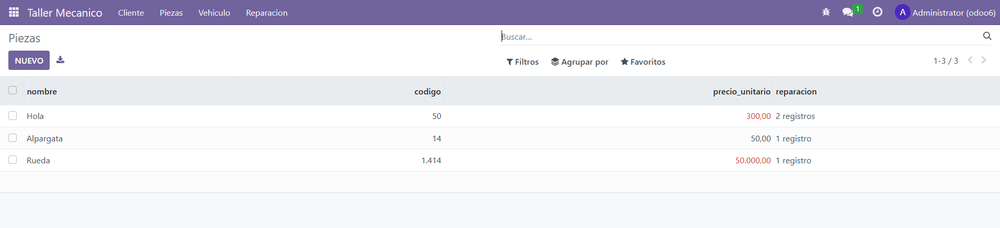
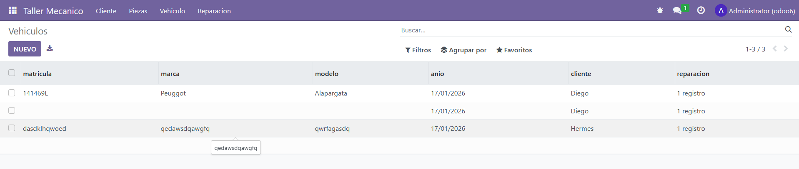
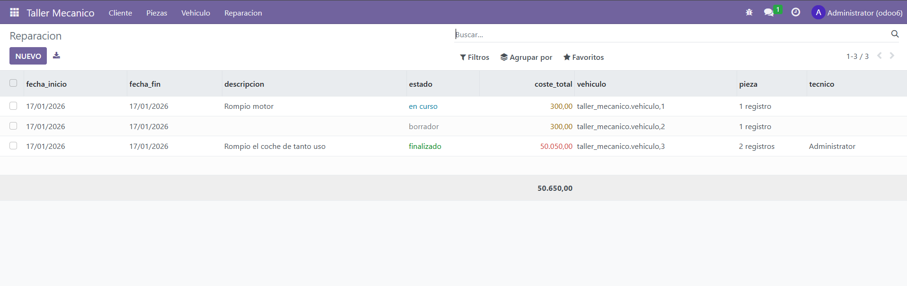

# PR0606

Modulos:

```python
from odoo import models, fields, api


class cliente(models.Model):
    _name = 'taller_mecanico.cliente'
    _description = 'taller_mecanico.cliente'

    name = fields.Char(
        string='nombre',
    )
    
    telefono = fields.Integer(
        string='telefono',
    )
    
    email = fields.Char(
        string='email',
    )
    
    direccion = fields.Char(
        string='direccion',
    )
    
    # One2Many con vehiculo
    vehiculo_ids = fields.One2many(
        string='vehiculo',
        comodel_name='taller_mecanico.vehiculo',
        inverse_name='cliente_id',
    )
```

```python
from odoo import models, fields, api


class pieza(models.Model):
    _name = 'taller_mecanico.pieza'
    _description = 'taller_mecanico.pieza'

    
    nombre = fields.Char(
        string='nombre',
    )
    
    codigo = fields.Integer(
        string='codigo',
    )
    
    precio_unitario = fields.Float(
        string='precio_unitario',
    )
    
    # Many2many con reparacion
    reparacion_ids = fields.Many2many(
        string='reparacion',
        comodel_name='taller_mecanico.reparacion',
    )
```

```python
from odoo import models, fields, api


class reparacion(models.Model):
    _name = 'taller_mecanico.reparacion'
    _description = 'taller_mecanico.reparacion'
    
    fecha_inicio = fields.Date(
        string='fecha_inicio',
        default=fields.Date.context_today,
    )
    
    fecha_fin = fields.Date(
        string='fecha_fin',
        default=fields.Date.context_today,
    )
    
    descripcion = fields.Char(
        string='descripcion',
    )
    
    estado = fields.Selection(
        string='estado',
        selection=[('borrador', 'borrador'), ('en curso', 'en curso'), ('finalizado', 'finalizado')]
    )
    
    coste_total = fields.Float(
        string='coste_total',
        compute='calculo_total'
    )
    
    # Many2one con vehiculo
    vehiculo_id = fields.Many2one(
        string='vehiculo',
        comodel_name='taller_mecanico.vehiculo',
        ondelete='cascade',
    )
    
    # Many2many con pieza
    pieza_ids = fields.Many2many(
        string='pieza',
        comodel_name='taller_mecanico.pieza',
    )
    
    # Many2one con tecnico (res.users)
    tecnico_id = fields.Many2one(
        string='tecnico',
        comodel_name='res.users',
        ondelete='cascade',
    )
    
    # Coste total
    def calculo_total(self):
        for record in self:
            record.coste_total = sum(record.pieza_ids.mapped('precio_unitario'))
```

```python
from odoo import models, fields, api


class vehiculo(models.Model):
    _name = 'taller_mecanico.vehiculo'
    _description = 'taller_mecanico.vehiculo'

    
    matricula = fields.Char(
        string='matricula',
    )
    
    marca = fields.Char(
        string='marca',
    )
    
    modelo = fields.Char(
        string='modelo',
    )
    
    anio = fields.Date(
        string='anio',
        default=fields.Date.context_today,
    )
    
    # Many2one con cliente
    cliente_id = fields.Many2one(
        string='cliente',
        comodel_name='taller_mecanico.cliente',
        ondelete='cascade',
    )
    
    # One2many con reparacion
    reparacion_ids = fields.One2many(
        string='reparacion',
        comodel_name='taller_mecanico.reparacion',
        inverse_name='vehiculo_id',
    )
    
    
```

models/init.py:

```python
# -*- coding: utf-8 -*-

from . import cliente
from . import pieza
from . import reparacion
from . import vehiculo
```

manifest.py:

```python
# -*- coding: utf-8 -*-
{
    'name': "TallerMecanico",

    'summary': """
        Short (1 phrase/line) summary of the module's purpose, used as
        subtitle on modules listing or apps.openerp.com""",

    'description': """
        Long description of module's purpose
    """,

    'author': "My Company",
    'website': "https://www.yourcompany.com",

    # Categories can be used to filter modules in modules listing
    # Check https://github.com/odoo/odoo/blob/16.0/odoo/addons/base/data/ir_module_category_data.xml
    # for the full list
    'category': 'Uncategorized',
    'version': '0.1',

    # any module necessary for this one to work correctly
    'depends': ['base'],

    # always loaded
    'data': [
        'security/ir.model.access.csv',
        'views/views.xml',
        'views/templates.xml',
    ],
    # only loaded in demonstration mode
    'demo': [
        'demo/demo.xml',
    ],
}

```

ir.model.access.csv:

```csv
id,name,model_id:id,group_id:id,perm_read,perm_write,perm_create,perm_unlink
access_cliente,taller_cliente,model_taller_mecanico_cliente,base.group_user,1,1,1,1
access_pieza,taller_pieza,model_taller_mecanico_pieza,base.group_user,1,1,1,1
access_reparacion,taller_reparacion,model_taller_mecanico_reparacion,base.group_user,1,1,1,1
access_vehiculo,taller_vehiculo,model_taller_mecanico_vehiculo,base.group_user,1,1,1,1
```

views.xml

```xml
<odoo>
  <data>
    <!-- explicit list view definition -->

    <record model="ir.ui.view" id="taller_mecanico.cliente">
      <field name="name">TallerMecanico.cliente list</field>
      <field name="model">taller_mecanico.cliente</field>
      <field name="arch" type="xml">
        <tree>
          <field name="name"/>
          <field name="telefono"/>
          <field name="email"/>
          <field name="direccion"/>
          <field name="vehiculo_ids"/>
        </tree>
      </field>
    </record>

    <record model="ir.ui.view" id="taller_mecanico.pieza">
      <field name="name">TallerMecanico.pieza list</field>
      <field name="model">taller_mecanico.pieza</field>
      <field name="arch" type="xml">
        <tree>
          <field name="nombre"/>
          <field name="codigo"/>
          <field name="precio_unitario"
              decoration-success= "precio_unitario &lt; 10"
              decoration-danger= "precio_unitario &gt; 100"
            />
          <field name="reparacion_ids"/>
        </tree>
      </field>
    </record>

    <record model="ir.ui.view" id="taller_mecanico.vehiculo">
      <field name="name">TallerMecanico.vehiculo list</field>
      <field name="model">taller_mecanico.vehiculo</field>
      <field name="arch" type="xml">
        <tree>
          <field name="matricula"/>
          <field name="marca"/>
          <field name="modelo"/>
          <field name="anio"/>
          <field name="cliente_id"/>
          <field name="reparacion_ids"/>
        </tree>
      </field>
    </record>

    <record model="ir.ui.view" id="taller_mecanico.reparacion">
      <field name="name">TallerMecanico.reparacion list</field>
      <field name="model">taller_mecanico.reparacion</field>
      <field name="arch" type="xml">
        <tree>
          <field name="fecha_inicio"/>
          <field name="fecha_fin"/>
          <field name="descripcion"/>
          <field name="estado"
            decoration-muted = "estado == 'borrador'"
            decoration-info = "estado == 'en curso'"
            decoration-success = "estado == 'finalizado'"

          />
          <field name="coste_total"
            decoration-danger= "coste_total &gt; 500"
            decoration-warning= "coste_total &gt;= 100 and coste_total &lt;= 500"
            decoration-success= "coste_total &lt; 100"
            avg = "1"
            sum ="1"
          />
          <field name="vehiculo_id"/>
          <field name="pieza_ids"/>
          <field name="tecnico_id"/>
        </tree>
      </field>
    </record>


    <!-- actions opening views on models -->

    <record model="ir.actions.act_window" id="taller_mecanico.action_window">
      <field name="name">Cliente</field>
      <field name="res_model">taller_mecanico.cliente</field>
      <field name="view_mode">tree,form</field>
    </record>

    <record model="ir.actions.act_window" id="taller_mecanico.action_window_pieza">
      <field name="name">Piezas</field>
      <field name="res_model">taller_mecanico.pieza</field>
      <field name="view_mode">tree,form</field>
    </record>

    <record model="ir.actions.act_window" id="taller_mecanico.action_window_vehiculo">
      <field name="name">Vehiculos</field>
      <field name="res_model">taller_mecanico.vehiculo</field>
      <field name="view_mode">tree,form</field>
    </record>

    <record model="ir.actions.act_window" id="taller_mecanico.action_window_reparacion">
      <field name="name">Reparacion</field>
      <field name="res_model">taller_mecanico.reparacion</field>
      <field name="view_mode">tree,form</field>
    </record>

    <!-- server action to the one above -->

    <!-- <record model="ir.actions.server" id="taller_mecanico.action_server">
      <field name="name">TallerMecanico server</field>
      <field name="model_id" ref="model_taller_mecanico_taller_mecanico"/>
      <field name="state">code</field>
      <field name="code">
        action = {
          "type": "ir.actions.act_window",
          "view_mode": "tree,form",
          "res_model": model._name,
        }
      </field>
    </record> -->


    <!-- Top menu item -->

    <menuitem name="Taller Mecanico" id="taller_mecanico.menu_root"/>

    <!-- menu categories -->

    <menuitem name="Cliente" id="taller_mecanico.menu_1" parent="taller_mecanico.menu_root"/>
    <menuitem name="Piezas" id="taller_mecanico.menu_2" parent="taller_mecanico.menu_root"/>
    <menuitem name="Vehiculo" id="taller_mecanico.menu_3" parent="taller_mecanico.menu_root"/>
    <menuitem name="Reparacion" id="taller_mecanico.menu_4" parent="taller_mecanico.menu_root"/>

    <!-- actions -->

    <menuitem name="Listar Clientes" id="taller_mecanico.menu_1_list" parent="taller_mecanico.menu_1"
              action="taller_mecanico.action_window"/>
    <menuitem name="Listar Piezas" id="taller_mecanico.menu_2_list" parent="taller_mecanico.menu_2"
              action="taller_mecanico.action_window_pieza"/>
    <menuitem name="Listar Vehiculo" id="taller_mecanico.menu_3_list" parent="taller_mecanico.menu_3"
              action="taller_mecanico.action_window_vehiculo"/>
    <menuitem name="Listar Reparacion" id="taller_mecanico.menu_4_list" parent="taller_mecanico.menu_4"
              action="taller_mecanico.action_window_reparacion"/>

  </data>
</odoo>
```

Funcionamiento:






