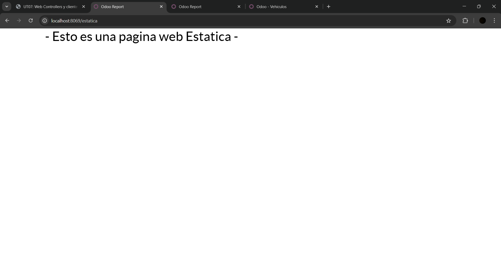
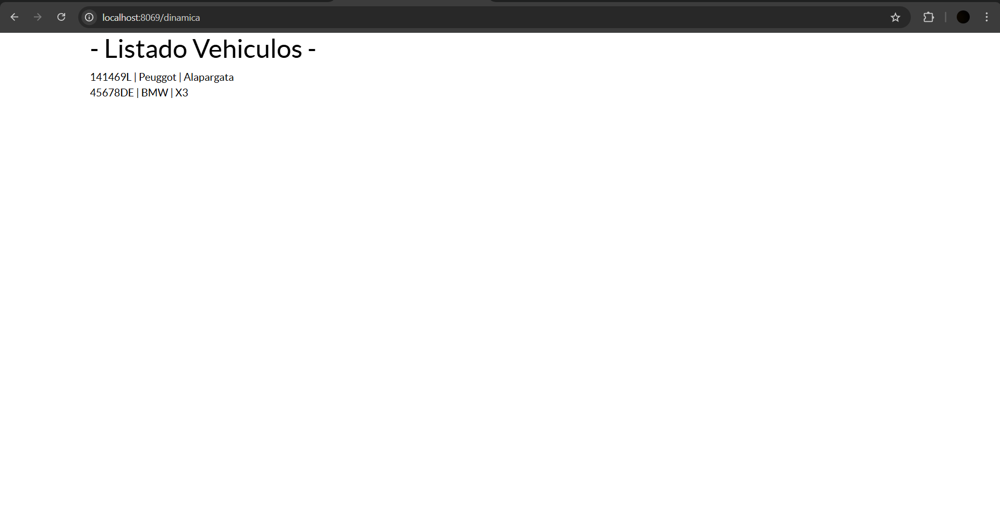

## Pr0701

controllers.py:

```python
# # -*- coding: utf-8 -*-
from odoo import http
from odoo.http import request

class TallerMecanico(http.Controller):
    @http.route("/estatica", type="http", auth="public", website=True)
    def pag_estatica(self, **kwargs):
        return http.request.render("taller_mecanico.estatica", {})
    
    @http.route("/dinamica", type="http", auth="public", website=True)
    def pag_dinamica(self, **kwargs):
        vehiculos = request.env["taller_mecanico.vehiculo"].search([])
        return http.request.render("taller_mecanico.datos_list", {'vehiculos': vehiculos})
```

manifest.py:

```python
# -*- coding: utf-8 -*-
{
    'name': "TallerMecanico",

    'summary': """
        Short (1 phrase/line) summary of the module's purpose, used as
        subtitle on modules listing or apps.openerp.com""",

    'description': """
        Long description of module's purpose
    """,

    'author': "My Company",
    'website': "https://www.yourcompany.com",

    # Categories can be used to filter modules in modules listing
    # Check https://github.com/odoo/odoo/blob/16.0/odoo/addons/base/data/ir_module_category_data.xml
    # for the full list
    'category': 'Uncategorized',
    'version': '0.1',

    # any module necessary for this one to work correctly
    'depends': ['base', 'website'],

    # always loaded
    'data': [
        'security/ir.model.access.csv',
        'views/views.xml',
        'views/templates.xml',
        'views/estatica.xml',
        'views/datos_list.xml'
    ],
    # only loaded in demonstration mode
    'demo': [
        'demo/demo.xml',
    ],
}
```

datos_list.xml:

```xml
<odoo>
    <data>
        <template id="datos_list" name="Pagina dinamica ">
            <t t-call="web.html_container">
                <div class="container">
                    <h1>- Listado Vehiculos -</h1>
                    <t t-foreach="vehiculos" t-as="vehiculo">
                        <div class="vehiculo">
                            <span><t t-esc="vehiculo.matricula"/></span> |
                            <span><t t-esc="vehiculo.marca"/></span> |
                            <span><t t-esc="vehiculo.modelo"/></span>
                        </div>
                    </t>
                </div>
            </t>
        </template>
    </data>
</odoo>
```

estatica.xml:

```xml
<odoo>
    <data>
        <template id="estatica" name="Pagina estatica">
            <t t-call="web.html_container">
                <div class="container">
                    <h1>- Esto es una pagina web Estatica -</h1>
                </div>
            </t>
        </template>
    </data>
</odoo>
```

Funcionamiento:



