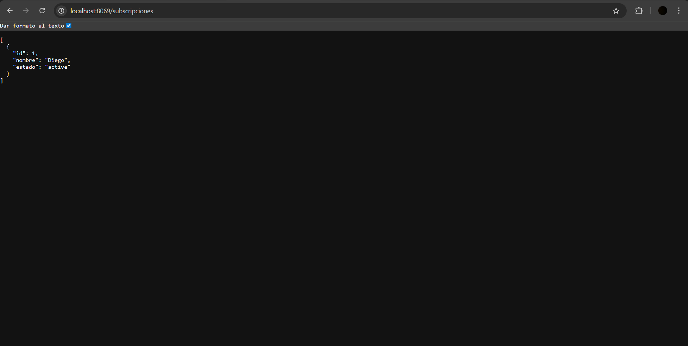
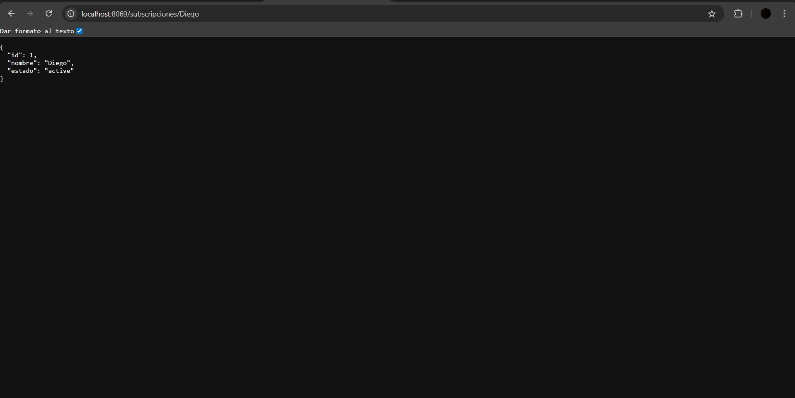

# PR0702

controllers:

```python
# -*- coding: utf-8 -*-
from odoo import http
from odoo.http import request, Response
import json

class SubscriptionController(http.Controller):
    @http.route('/subscripciones', auth='public', type='http', methods=['GET'], csrf=False)
    def getSubscripciones(self, **kwargs):
        estado = kwargs.get('status')
        estadoPer = ['active', 'inactive']
        if estado:
            if estado not in estadoPer:
                return Response(json.dumps({'error': 'No hay subscripciones'}), status=400, content_type='application/json')
            domain = [('status', '=', estado)]
        else:
            domain = []
        subscriptions = request.env['subscription.subscription'].search(domain)
        
        result = []
        for sub in subscriptions:
            result.append({
                'id': sub.id,
                'nombre': sub.name,
                'estado': sub.status,
            })
        return Response(json.dumps(result), content_type='application/json')
    
    @http.route('/subscripciones/<string:name>', auth='public', type='http', methods=['GET'], csrf=False)
    def getSubscripcionesByNombre(self, name):
        subscription = request.env['subscription.subscription'].search([('name', '=', name)], limit=1)
        
        if not subscription:
            return Response(json.dumps({'error': 'No existe subscripcion'}), status=404, content_type='application/json')
        
        result = {
            'id': subscription.id,
            'nombre': subscription.name,
            'estado': subscription.status,
        }
        
        return Response(json.dumps(result), content_type='application/json')
```

Funcionamiento:



